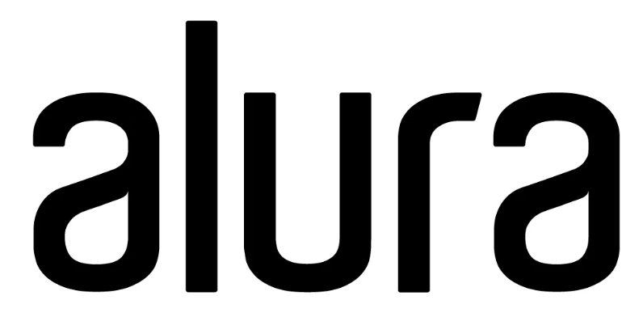

<h1 align="center">
    
</h1>

  <a href="#about">About</a>&nbsp;&nbsp;&nbsp;|&nbsp;&nbsp;&nbsp;  
  <a href="#technologies">Technologies Used</a>&nbsp;&nbsp;&nbsp;|&nbsp;
  <a href="#training">Training</a>&nbsp;&nbsp;&nbsp;|&nbsp;&nbsp;&nbsp;&nbsp;&nbsp;
  <a href="#license">License</a>

  

  

  

 

## :books: About

Alura is an online, practical and intensive training. At alura, students delve deeper into various training courses: programming, frontend, backend, data science, artificial intelligence, devOps, UI & design, mobile and innovation & management. So that the student can be ready for real-world challenges and stand out in the job market.

 

## ⚒️ Technologies Used

 * CSS3
 * HTML5

 

## :abacus: Frontend

- [Html e CSS](https://github.com/RuthMaria/alura-frontend-html-e-css)
- [Angular](https://github.com/RuthMaria/ignite-time)
- [Javascript](https://github.com/RuthMaria/ignite-DTMoney)

 

 

## :memo: License

This project is under the MIT license. See the  file [LICENSE](LICENSE.md) for more details.

---

<h4 align="center">
    Developed with ❤️ by <a href="https://www.linkedin.com/in/ruth-maria-9b256071/" target="_blank">Ruth Maria</a>
</h4>
